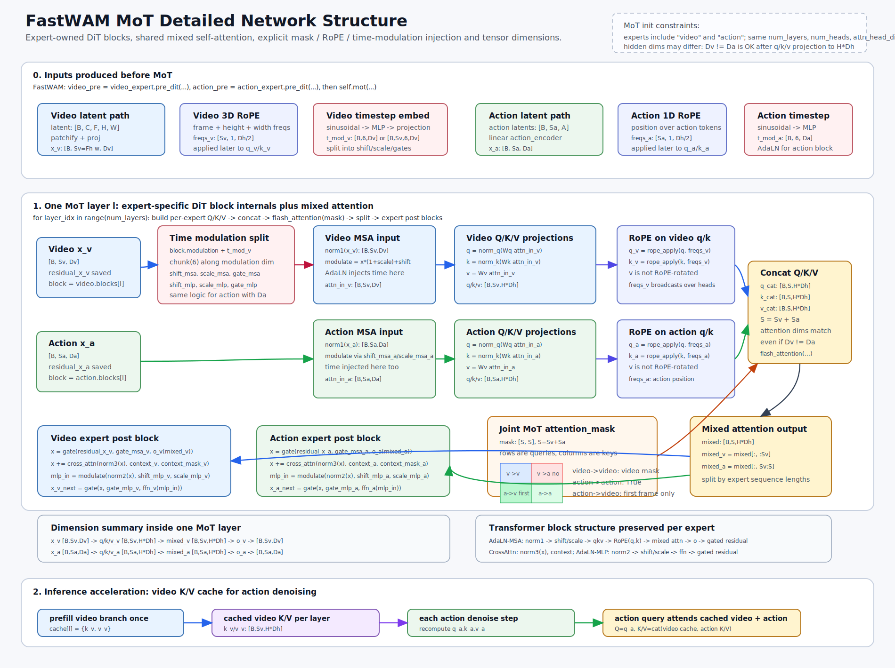

# FastWAM MoT Network Structure

This note accompanies `mot_network_structure.svg`.

## What The Diagram Shows

`MoT` mixes a video transformer expert and an action transformer expert at the self-attention level.

The diagram now shows three levels of detail:

1. Pre-MoT tensor preparation from `video_expert.pre_dit(...)` and `action_expert.pre_dit(...)`.
2. One detailed MoT layer, including time modulation, RoPE, Q/K/V projection, mixed attention mask, split, cross-attention, FFN, and gated residuals.
3. The inference-time video K/V cache path used by `forward_action_with_video_cache(...)`.

This keeps expert parameters separate while allowing token-level interaction through mixed attention.

## Per-Layer Flow

For each layer:

1. Each expert owns its own block and starts with `x_v: [B, Sv, Dv]` or `x_a: [B, Sa, Da]`.
2. The expert-specific timestep embedding is projected into six modulation tensors:
   `shift_msa`, `scale_msa`, `gate_msa`, `shift_mlp`, `scale_mlp`, `gate_mlp`.
3. Time is injected before self-attention through `modulate(norm1(x), shift_msa, scale_msa)`.
4. Each expert builds `q/k/v: [B, S*, H*Dh]`.
5. RoPE is applied only to `q` and `k`; `v` is not rotated.
6. `MoT` concatenates Q/K/V along sequence length and applies `flash_attention(..., attention_mask)`.
7. The output is split back into video/action slices.
8. Each expert applies its own `self_attn.o`, optional cross-attention, FFN, and gated residual paths.

## Attention Mask

The default FastWAM MoT mask is a boolean matrix of shape `[Sv + Sa, Sv + Sa]`:

- video query -> video key: controlled by the video expert's video-to-video mask
- video query -> action key: disabled
- action query -> action key: enabled
- action query -> video key: first-frame video tokens only

## Main Code Paths

- Full mixed forward: `fastwam.models.wan22.mot.MoT.forward`
- Per-expert QKV construction: `MoT._build_expert_attention_io`
- Mixed attention call: `MoT._mixed_attention`
- Expert post block: `MoT._apply_expert_post_block`
- Video cache prefill: `MoT.prefill_video_cache`
- Action denoising with cached video K/V: `MoT.forward_action_with_video_cache`

## Shape Legend

- `B`: batch size
- `Sv`: video token sequence length
- `Sa`: action token sequence length
- `Dv`: video expert hidden dimension
- `Da`: action expert hidden dimension
- `H`: number of attention heads
- `Dh`: per-head attention dimension

The experts may have different hidden dimensions, but `num_heads` and `attn_head_dim` must match so their attention tensors can be concatenated.
